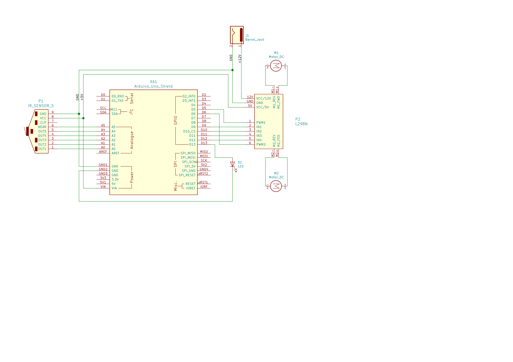

:Author: (Prashant Kumar)[https://github.com/krprashant94]
:Email: {kr.prashant94@gmail.com}
:Date: 25-06-2020
:Revision: 1.0.1
:License: MIT

= eagle

== Filename: goldenbird

An optimized Arduino line follower that uses port manipulation for fast performance. It is a 10x-20x faster than the ordinary Arduino powered PID controlled bot. The size is reduced by ~60% as compared to other files. 

[Tutorial](https://krprashant94.github.io/eagle/tutorial/)

== Circuit

Assemble the circuit as in circuit.svg

=== Folder structure

....
 goldenbird                                       => Arduino sketch folder
  ├── goldenbird.ino                              => Arduino File
  ├── circuit.svg                                 => Circuit Diagram
  └── README.adoc                                 => This File
....

=== Bill of the materials

|===
| SL | Part name         | Model           | Quantity
| 1  | BO Motor          | 300 RPM         | 1
| 2  | IR Sensor         | Array or single | 1
| 3  | Motor Driver      | l298N           | 1
| 4  | Arduino UNO       | R3              | 1
| 5  | Programming Cable | USB 2.0         | 1
|===
