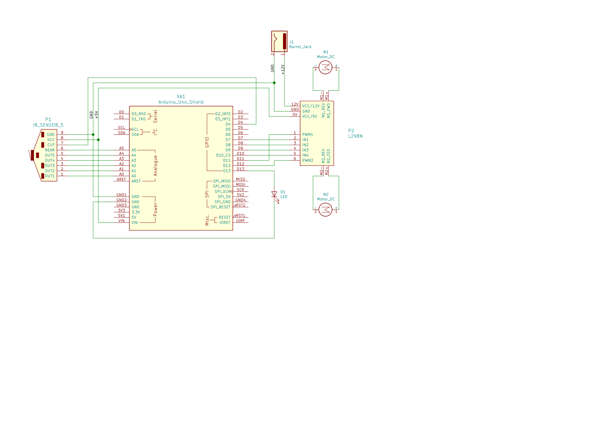

:Author: (Prashant Kumar)[https://github.com/krprashant94]
:Email: {kr.prashant94@gmail.com}
:Date: 03/02/2019
:Revision: 1.0.1
:License: MIT

= Project: eagle

A arduino line follower using five sensor array and PID programming.

[Tutorial](https://krprashant94.github.io/eagle/tutorial/)

== Circuit

Assemble the circuit as in circuit.svg

=== Folder structure

....
 harpy                                            => Arduino sketch folder
  ├── harpy.ino                                   => Arduino file
  ├── circuit.svg                                 => Circuit Diagram
  └── README.adoc                                 => This File
....

=== Bill of the materials

|===
| SL | Part name         | Model       | Quantity
| 1  | BO Motor          | 300 RPM     | 1
| 2  | Five Sensor Array | IR          | 1
| 3  | Motor Driver      | l298N       | 1
| 4  | Arduino UNO       | R3          | 1
| 5  | Programming Cable | USB 2.0     | 1
|===
