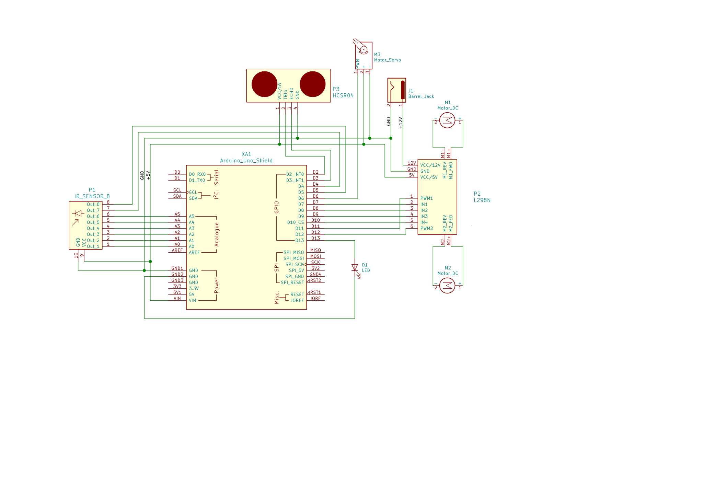

:Author: (Prashant Kumar)[https://github.com/krprashant94]
:Email: {kr.prashant94@gmail.com}
:Date: 03/02/2019
:Revision: 1.0.1
:License: MIT

= Project: eagle

An 8 IR sensor based PID controlled line follower bot this can follow black and white strip using IR sensor with ultrasonic obstacle/wall detection

[Tutorial](https://krprashant94.github.io/eagle/tutorial/)

== Circuit

Assemble the circuit as in Schematic.svg

=== Folder structure

....
 ornate                                           => Arduino sketch folder
  ├── ornate.ino                                  => Arduino file
  ├── circuit.svg                                 => Circuit Diagram
  └── README.adoc                                 => This File
....

=== Bill of the materials

|===
| SL | Part name         | Model          | Quantity
| 1  | BO Motor          | 300 RPM        | 1
| 2  | Five Sensor Array | IR             | 1
| 3  | Motor Driver      | L298N          | 1
| 4  | Arduino UNO       | R3             | 1
| 5  | Ultrasonic Sensor | HC-SR 04       | 1
| 6  | Servo Moror       | SG90 or MG995  | 1
| 7  | Programming Cable | USB 2.0        | 1
|===
