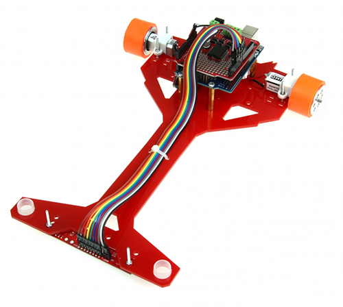
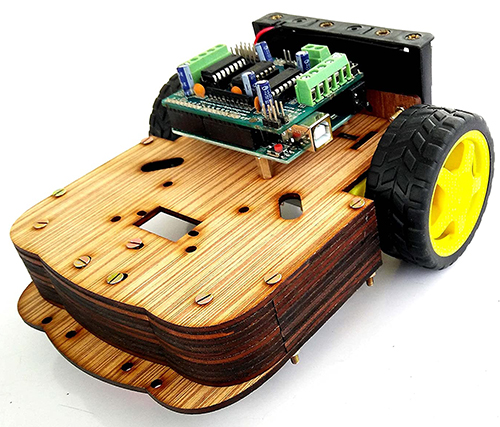
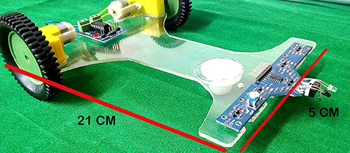
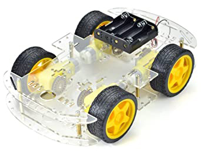
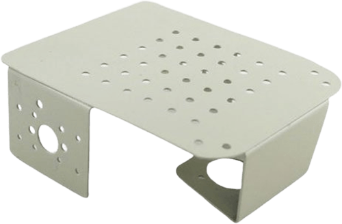

## Chassis

Chassis have a vital role in any robotics project. It not only makes the robot beautiful, but it also creates protection for electronic devices. A good chassis have lightweight and hard. So carefully select chassis material for robot.For our project, we can select one of the following chassis material

#### Plastic

lightweight but soft and not thermal protective can easily drill using a hot screw.

#### Hard cardboard

lightweight, thermal protection need a hand drill. 

#### Acrylic

Premade cutting available in the market. need drill bit easily break.

#### Bakelite

Hard to cut and drill. need hacksaw and hand drill. lightweaght, thermal protective, and durable.

#### Metal

Heavy durable but weighted. need a drill machine. However, it comes with some pre-drill hole and painted. *low torque motor not recommended*

#### Wooden
***Save Tree, Go Green***
