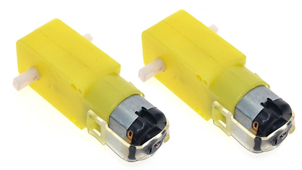
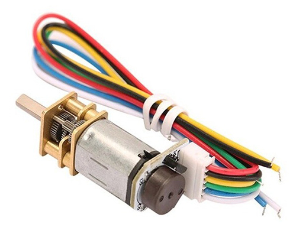
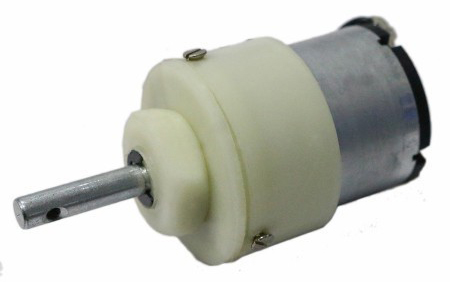
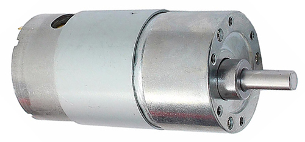
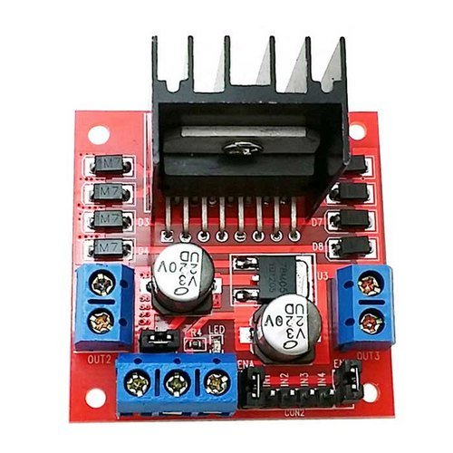
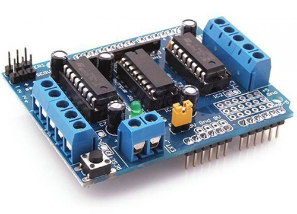

## Motor and Driver
For an autonomous robot, we are looking for lightweight motor. As we know our bot will not going to carry any heavy load or it is not going to pull anything. Our motor should be

* lightweight
* Low power consumption
* Good speed regulation

here we have some range of selection 
**100rpm to 300rpm motor is best suitable for an autonomous robot but in some case, many people use 500rpm**

> Be careful on selecting rpm of the motor. A high-speed motor runs fast and your sensor is not so fast, your robot may lose the track. [See the speed calculation](speed_calculator.html).

* **BO motor**: A BO motor is a lightweight motor that has plastic gears. It consists of DC motor inside the case. If your robot is light enough and you don't need speed regulation than it is a good choice. However, in metal chassis, BO motor may not deliver great results. The torque generated by this kind of motor is too less (\~150 gram) but not zero as told by many sellers.

* **Micro geared motor**: Small in size good torque and metal gare. The best choice if you are making small size robots. It comes with or without encoder.

* **Geared motor**: this kind of motor is useful when your robot has to carry some load or robot have to climb some critical inclined surface. This kind of motor has some extra weight and takes more power. A standard motor driver may burn if you insert these motor without calculating the maximum current. 

 

## Motor Driver

A motor may draw more than 150 mA or more current from the source. If you are planning to drive a motor with a microcontroller then forget your thoughts. A microcontroller(uP) can handle maximum \~40mA (some uP 60mA). So you need an electronic switch. A H-Bridge is such kind of switch that helps us to speed as-well-as direction control of the motor.

Some motor driver are:

| Driver    | Image                                    | Comment                                    |
|-----------|------------------------------------------|--------------------------------------------|
| L289N     |              | Dual H-Bridge, Heating problem without PID |
| L293D     |              | Single H-Bridge, Pololu                    |
| TB6612FNG |      | High Efficiency, SparkFun                  |

* You can use transistor also &#128540;

[L298N vs L293D](https://www.quora.com/What-is-the-difference-between-L298-and-L293/answer/Prashant-Kumar-2603)