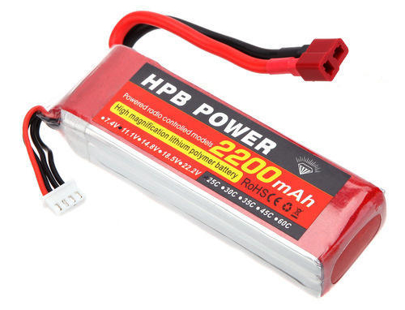
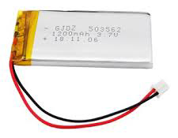
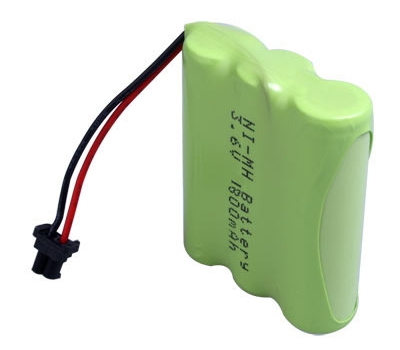
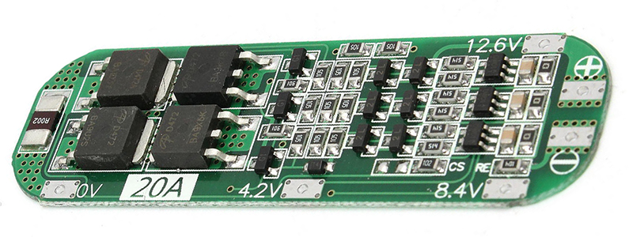
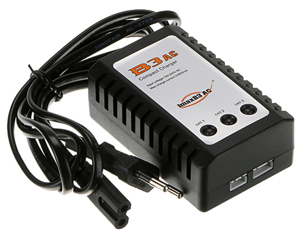
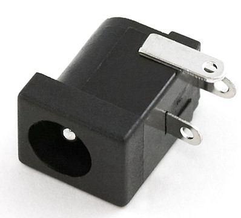

##  Power Supply

You can you two method to supply power to your bot
- Onboard Supply (battery)
- Using plug adapter

### Onboard Supply
A battery is a portable unit, you can use rechargeable or non-rechargeable as per your choice. The cost of a rechargeable battery is little high but it is cost-efficient on long run. 

A rechargeable battery type needs a balance charger. You can create your own charger or buy it form the market. Also, some battery needs a protection circuit to prevent over-discharge or overcharge.

| Battery              | mAh                 | Image        | Charger Req.     | DIY Charger | BMS Requirement | Charge Time |
|----------------------|---------------------|--------------|------------------|-------------|-----------------|-------------|
| LiPo                 | 1200 mAh +          |  | Y                | N           | Y               | 2 - 5 Hr    |
| LiPo                 | 150 mAh - 1000 mAh  |  | Y                | Y           | Not Important   | 0.5 - 2 Hr  |
| NiMh                 | 1500 mAh - 3500 mAh |  | Y                | N           | Y               | 1 - 5 Hr    |
| 9v                   | 150 mAh - 350 mAh   |  | non-rechargeable  | -           | N               | -           |
| AA 1.5v              | 1000mAh - 1500 mAH  |  | non-rechargeable  | -           | -               | -           |

### Charger

A balance charger is needed to charge the rechargeable battery. Applying overvoltage may damage the battery. Also over current may cause the hazardous effects.

| Charger            | Image                        | Comment    |
|--------------------|------------------------------|------------|
| NiMh BMS charger   |           | Charger and Protection circuit. 3S charger in image  |
| LiPo Charger       |  | Charger for 1S to 6S battery |

### Adapter

Using 12V, 1A or 2A adaptor is a cheap choice for bot it need an LM7805/LM2596 DC voltage regulator get get 5V supply in your device.

> Arduino can take 6V-12V power supply using barrel jack. Excess current or voltage may burn the Arduino chip. 

 
