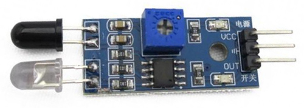
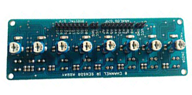
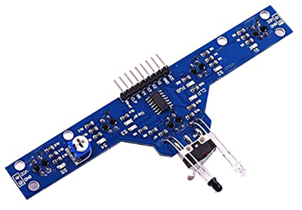
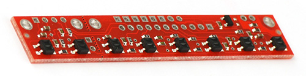

## Sensor

The sensor is the eye of your line follower. It should fast refresh rate. To detect line strip you can use
1. IR Sensor - Black and white
2. LDR - Black and white track 
3. LDR with RGB LED - color track 

> For our project, I am always using IR sensor. It will be either 5 sensor array with an obstacle sensor or 8 sensor array.

| SL | Sensor            | Image                                | Comment                              |
|----|-------------------|--------------------------------------|--------------------------------------|
| 1  | Single IR Sensor  |             | Simple and easy to use for beginner  |
| 2  | 8 Sensor Array    |              | Analog as-well-as digital output     |
| 2  | 5 Sensor Array    |          | With obstacle (IR/machanical) sensor |
| 2  | Pololu            |             | Auto calibration and fast refresh    |
