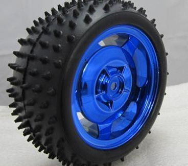

## Wheel

> ***[Speed calculation](speed_calculator.html)***

Wheels have an essential and critical role when it comes to competition. When you going to select a wheel you must check there parameter

- Wheel diameter
- Wheel width/span
- Not to much friction between wheel and surface
- Not too less friction between wheel and surface

### Diameter
 
 It finally gives you speed. Suppose your wheel has ***d mm*** diameter, your motor has ***r rpm*** and you are running your motor in ***p % of power***. (for full speed it will 100 % of power)

Circumference of wheel = Lenght travelled in one rotation 
 = π * d *mm*

Actual rpm = (r * p )/100 *rpm*
 = r * p  * 0.01 *rpm*

No of revolution in one second (rps) = r * p  * 0.01/60 *rps*

Thus the speed of your bot will be = π * d * rps *mm/s*

Now sensing power comes into play. It is very important that your sensor is compatible with this much speed suppose your sensor can takes reading every t second. (generally for IR sensor it is 0.01 sec).

i.e. at t second, you will travel π * d * rps * t *mm* (say *L mm*). This means you can only take reading at every L mm distance. If your wheel size to big you may skip the track and your wheel is too small you will finish track at last.

