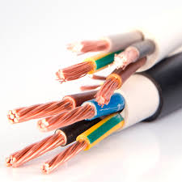
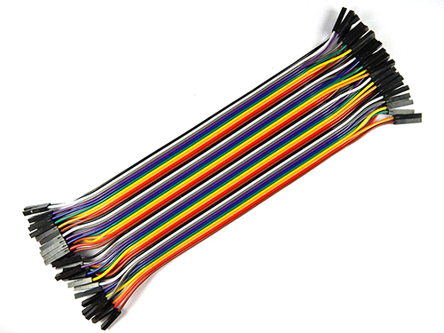
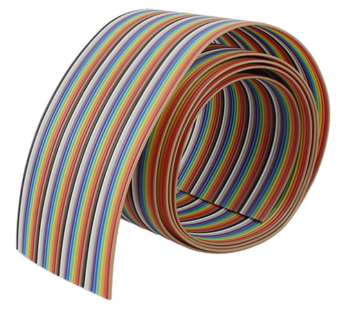
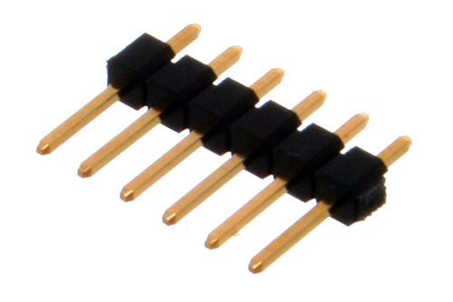
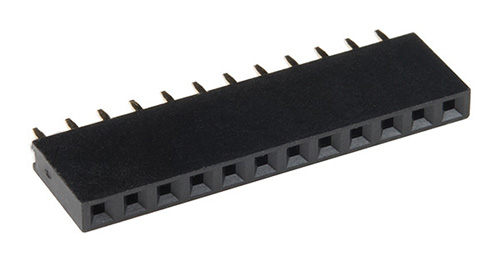

## Wire
### Single-Core wire
A single core wire is best suitable for the breadboard circuit assemble. I strongly recommend you, test your circuit on a breadboard before making a PCB or soldering. Because once you solder, desoldering is a quite hard task and may damage your whole assembly. You can purchase different color of wite to distinguish wire clearly.

> Single core wire may be a not good choice. It may create a considerable voltage drop across wires, and you will never get why you are not getting proper 5V even your connection is correct. It is not too much flexable.

### Multi-core wire
Multicore wires have less voltage drop in wire and it is flexable. But this kind of wires is not breadboarded friendly.

### Jumper wire
Jumper wires are the special king of wire which has soldered header. they come in many verity and friendly when working with Arduino or breadboard or sometimes best for temporary assembly.

### Rainbow ribbon
When it comes to making a project, making clean wiring is a challenging task. Rainbow ribbons are good when it comes to clean wiring. generally they are multicore

### Header
Header is pins used to fix in either breadboard or PCB below are picture of header. 
they are two kinds of header
- Male 
- Female

> It is a type of connector they are too many kinds to connector like DB9, USB, *Barrel Jack*

*Male Header Pins*

*Female Header Pins*
